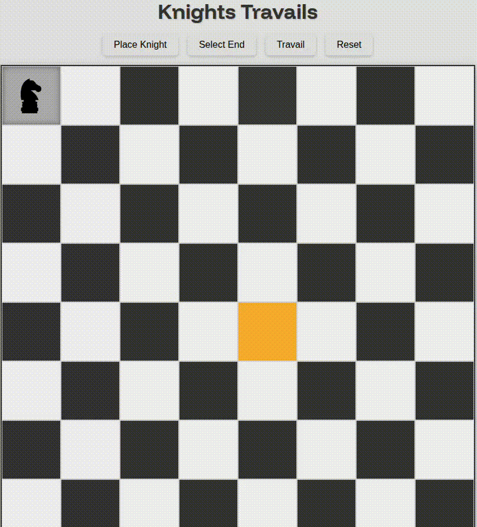

# Knights Travail

---

## 🔗 [Live Demo](https://musab-od.github.io/Knights-Travails/)

A visual representation of a knight traversing a chessboard to reach a destination using the shortest path.

### ⚙️ How It Works

- Click **"Place Knight"** to position the knight on the board
- Click **"Select End"** to choose the destination square
- Hit **"Travail"** to visualize the 'shortest' path (fingers crossed 🤞)

### 📝 Notes

- Built as part of [The Odin Project’s JavaScript Curriculum](https://www.theodinproject.com/paths/full-stack-javascript/courses/javascript)
- Knight vector assets sourced from [SVG Repo](https://www.svgrepo.com)
